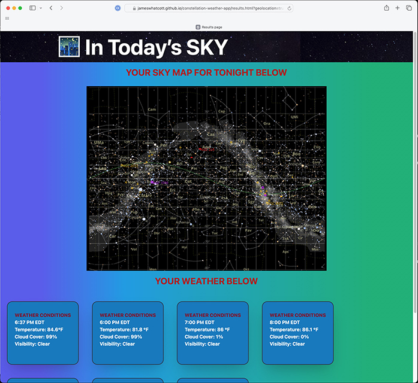

# Constellation Weather

## User Story

As an astronomy hobbyist, I want an app that will show me what constellations will be visible in the night sky at my location.
As an astronomy hobbyist, I want the app to tell if weather conditions will make for good skywatching at my location.
As an astronomy hobbyist, I want to choose how the app determines my location.
As an astronomy hobbyist, I want to be able to look at the sky and weather conditions that I have viewed in the past.
As an astronomy hobbyist, I want to be able to use the app on my mobile device and on a desktop or laptop computer.

## Minimum Viable Product Acceptance Criteria

The app will reach "minimum viable product" status when upon opening, the user is presented with a splash page identifying the app and its creators.
The app will reach MVP staus when a modal dialog box automatically opens and prompts the user to choose the method for determining her location: by geolocation or by postal code.
The app will reach MVP status when the app locates the user.
The app will reach MVP status when the app close the splash page and opens a results page showing a map of the sky at the user's location.
The app will reach MVP status when the app forecasts the weather conditions that will affect skywatching at the locationatcott, and Matthew Williams developed version 0.1 of Constellation Weather
## Description

Constellation Weather obtains a user location using either automatic geolocation (which will require the user's permission) or a postal code provided by the user. Once located, the app presents the user with a sky map at his location and advises the user about the weather conditions that will affect the quality of that night's skywatching.

## Installation

Constellation Weather requires no installation. However, a user will be prompted to allow her browser to use her location if she has not done provided such permission in the past.

## Usage

Constellation Weather is simple to use. Upon opening the app, the user is presented with a splash screen followed by a modal dialog box asking how the app should determine the user's location. Once the "Go!" button on modal dialog box is clicked, the splash page closes, and a results page appears showing the sky and constellations visible at the user's location and providing weather information that the user can consider when determining whether or not tonight will be a good night for skywatching. If the user wants to return to input another location, he clicks on the "Again!" button to return to the modal dialog box.

A screen shot of a results page is below. To launch the app, click [here](https://jameswhatcott.github.io/constellation-weather-app/).

.

## Potential New and Improved Features

1. Create a history of previous searches.
2. Insert weather animations based on conditions.
3. Create animations for zooming into space to see what space would look like the deeper you travel.
4. Create proper scrolling transitions.
5. Internationalize the app to accept more than U.S. postal codes.
6. Allow users to choose see the sky map and weather on a date of her choosing.

## Version History

* 0.1
    * Initial Release

### Credits and Acknowledgments

Caleb Francis, Brian Nyamohanga, James Whatcott, and Matthew Williams developed version 0.1 of Constellation Weather. Rene Trevino and Slavic Andreev provided significant support.